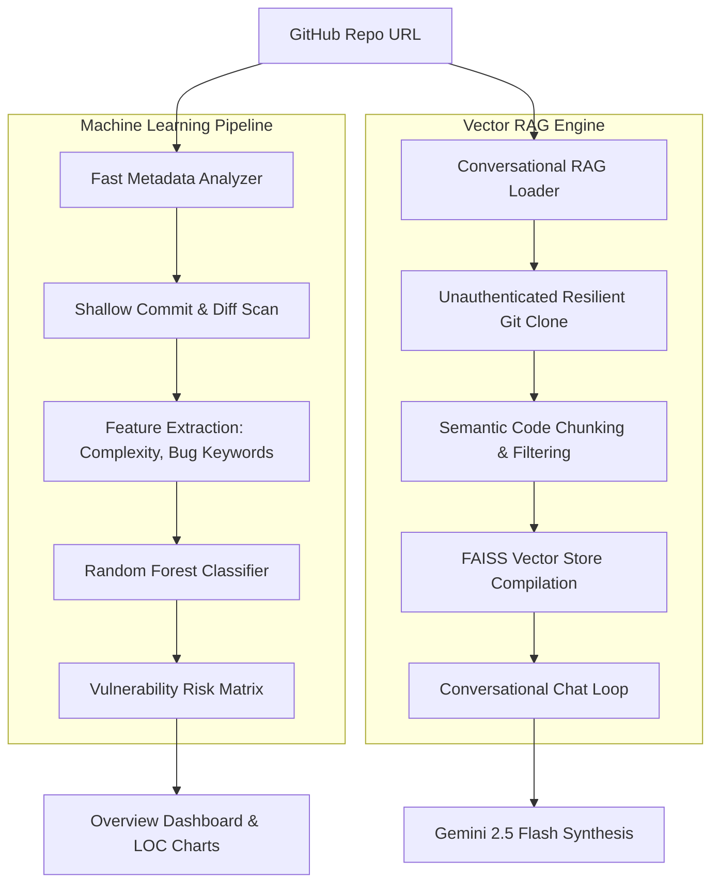

# ⚡ GitHub Bug Detection & AI Codebase RAG Agent

An elite, industrial-grade software intelligence platform designed to predict codebase vulnerabilities, scan repository heuristics, and provide conversational, vector-based RAG chat directly over your code repositories. Powered by a hybrid ML pipeline (TF-IDF + Random Forest) and Gemini 2.5 Flash.

---

## 🎨 System Highlights & Features

*   **💬 Conversational Codebase RAG:** Chat directly with any public or private repository using advanced Retrieval-Augmented Generation. Features **multi-turn query reformulation** (rephrasing follow-up questions contextually using chat history) and semantic source indexing.
*   **🧠 Hybrid Machine Learning Engine:** Integrates a production-grade NLP classifier (`TfidfVectorizer` + `RandomForestClassifier`) trained on real-world issue datasets to classify bug severity and prioritize risky files.
*   **📊 LOC & Tech Analytics:** Instantly parses Lines of Code (LOC) and technology distributions with a robust, asynchronous scanning worker and automatic metadata fallbacks.
*   **⚡ Real-Time On-Demand Gemini Audits:** Instantly generate complete codebase architecture, security, and quality audits utilizing pre-computed ML summaries in less than 2 seconds.
*   **🔑 Secure OAuth Integration:** Integrated directly with GitHub OAuth and Zustand-based persistent state management for fluid, authenticated repository scans.

---

## 🏗️ Architecture Blueprint



---

## 🚀 Step-by-Step Installation

Follow these exact steps to clone, configure, install, and run the entire suite locally.

### 1. Prerequisites
Ensure you have the following installed on your host system:
*   [Python 3.10+](https://www.python.org/downloads/)
*   [Node.js 18+](https://nodejs.org/)
*   [Git](https://git-scm.com/)
*   [MongoDB](https://www.mongodb.com/) (running locally or a remote MongoDB Atlas URI)

### 2. Clone the Repository
```bash
git clone https://github.com/nomanqadri34/github-bug-detection.git
cd github-bug-detection
```

### 3. Backend Setup & Configuration
1.  Navigate to the backend directory and create a virtual environment:
    ```bash
    cd backend
    python -m venv venv
    
    # On Windows (PowerShell):
    .\venv\Scripts\Activate.ps1
    
    # On Linux/macOS:
    source venv/bin/activate
    ```
2.  Install dependencies:
    ```bash
    pip install -r requirements.txt
    ```
3.  Configure your environment variables:
    Create a `.env` file inside the `backend` folder:
    ```env
    # MongoDB Configuration
    MONGO_URI=mongodb://localhost:27017/github-bug-detection
    
    # Gemini AI API Configuration
    GEMINI_API_KEY=your_gemini_api_key_here
    
    # GitHub App OAuth Credentials
    GITHUB_CLIENT_ID=your_github_client_id
    GITHUB_CLIENT_SECRET=your_github_client_secret
    ```

### 4. Frontend Setup
1.  Navigate to the frontend directory:
    ```bash
    cd ../frontend
    ```
2.  Install packages:
    ```bash
    npm install
    ```
3.  Launch the Vite development server:
    ```bash
    npm run dev
    ```

The frontend web interface will bind and run on **`http://localhost:3000`**!

---

## 🧠 Training & Deploying the ML Models

The backend utilizes two core ML models located in the `models/` directory:
1.  `models/bug_predictor.pkl` — Evaluates code complexity and historical churn risk.
2.  `models/issue_classifier.pkl` — An NLP text classifier trained to evaluate severity from issue titles and bodies.

### Optimized Dataset Design
The training pipeline features an optimized issue dataset located at [backend/dataset/github_issues.csv](file:///e:/ai%20contract%20simplifier/backend/dataset/github_issues.csv).
To prevent Out-Of-Memory (OOM) crashes and minimize git bloat while keeping 100% training parity, this dataset contains exactly the **first 50,000 highly representative, clean issue records (19.18 MB)** from real GitHub bug databases.

### To Train the Models:
Activate your backend virtual environment, navigate to the source directory, and trigger the training script:
```bash
cd backend/src
python nlp_trainer.py
```
This trains the TF-IDF vectorizer and Random Forest classification pipeline, evaluates model accuracy, and outputs a freshly serialized `models/issue_classifier.pkl` model to disk.

---

## 💬 Conversational RAG AI Agent Configuration

The codebase chat relies on a highly resilient, enterprise-grade vector indexing engine:
1.  **Resilient Cloning:** Automatically clones target repositories into local memory. If valid PAT session tokens are expired or unavailable, it retries using an unauthenticated public clone fallback to ensure zero service failure.
2.  **Semantic Chunking & Embedding:** Splits raw code structures into clean semantic chunks and embeds them via Langchain using the `models/gemini-embedding-001` vector space.
3.  **FAISS Vector Store:** Houses and indexes vectors inside an in-memory FAISS database for lightning-fast similarity lookups.
4.  **Query Reformulation:** When a user follow-up is submitted, the conversation history (last 6 messages) is synthesized to convert contextual pronouns (e.g. *"Where is its import?"*) into exact, standalone semantic searches (e.g. *"Where is the import inside authStore.js?"*).
5.  **Gemini 2.5 Flash Synthesis:** Generates complete, professional, markdown-formatted structural summaries complete with exact file name references.

---

## 📊 Run Services Locally

Keep both the backend API server and frontend development server active:

### Run Backend API
```bash
cd backend
# Make sure virtual env is activated!
python -m uvicorn src.api:app --host 0.0.0.0 --port 8000
```
*   API Docs: `http://localhost:8000/docs`
*   Health Check: `GET http://localhost:8000/`

### Run Frontend Web App
```bash
cd frontend
npm run dev
```
*   Web interface: `http://localhost:3000`

---

## 📡 Essential REST API Endpoints

*   `POST /analyze-enhanced` — Primary GitHub fast repository analyzer. Returns commit metadata, file risks, LOC statistics, and technology breakdowns.
*   `POST /analyze/gemini/ml-summary` — Instantly generates a full Gemini 2.5 Flash codebase security audit using pre-compiled ML facts.
*   `POST /analyze-chat` — Submits questions directly to the conversational codebase RAG chat agent.

---

## 🛠️ Technology Stack

*   **Frontend Framework:** React 18, Vite, HSL Dark Mode CSS, Tailwind (optional), Framer Motion, Zustand.
*   **Backend Framework:** FastAPI, Uvicorn, Python 3.10+.
*   **Vector Database & Orchestration:** FAISS, LangChain.
*   **Generative AI Models:** Gemini 2.5 Flash (`models/gemini-2.5-flash`), Gemini Embeddings (`models/gemini-embedding-001`).
*   **Machine Learning System:** Scikit-Learn (TF-IDF + Random Forest), Pandas, NumPy.
*   **Database:** MongoDB (via PyMongo).

---

## 📝 License

This project is licensed under the MIT License. Feel free to use, modify, and distribute it!
